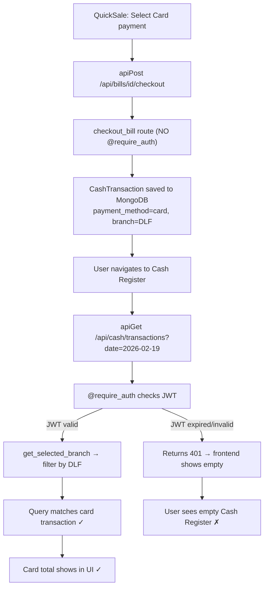

# Fix Cash Register Card/UPI Payment Display

## What is confirmed working

- Card transaction **IS saved correctly** in MongoDB: `payment_method: "card"`, `amount: 9799`, `branch: DLF`, `transaction_date: 2026-02-19`
- Backend save logic in [`bill_routes.py`](backend/routes/bill_routes.py) (lines 1303-1322) is correct
- Frontend summary mapping in [`CashRegister.jsx`](frontend/src/components/CashRegister.jsx) is correct

## Root Cause

The `checkout_bill` route has **no `@require_auth` decorator**, which creates an auth inconsistency between saving and reading:

```python
# bill_routes.py line 938 -- MISSING @require_auth
@bill_bp.route('/bills/<id>/checkout', methods=['POST'])
def checkout_bill(id):
    ...
    cash_txn = CashTransaction(...)
    cash_txn.save()  # Saves correctly ✓
```

The Cash Register GET routes **do** require auth. If the user's JWT token is expired or references a deleted account, `@require_auth` returns 401, and the frontend silently catches it and shows empty data -- the user sees nothing with no error message.

Also, the `CashTransaction` save failure is **silently swallowed**:

```python
except Exception as e:
    print(f"[CHECKOUT] Warning: Failed to record cash transaction: {e}")
    # No re-raise, no user-facing error
```

## Data Flow



## Fixes

### 1. Add `@require_auth` to `checkout_bill`

In [`backend/routes/bill_routes.py`](backend/routes/bill_routes.py) line 938-939, add the decorator so the auth context is consistent with all other routes.

### 2. Show auth error in Cash Register instead of silent empty state

In [`frontend/src/components/CashRegister.jsx`](frontend/src/components/CashRegister.jsx), catch 401 responses and show a "Session expired, please log in again" message instead of silently showing empty data.

### 3. Make cash transaction save failure visible in checkout response

In [`backend/routes/bill_routes.py`](backend/routes/bill_routes.py) lines 1321-1322, include a warning in the checkout response JSON if the cash transaction failed to save, so the frontend can alert the user.