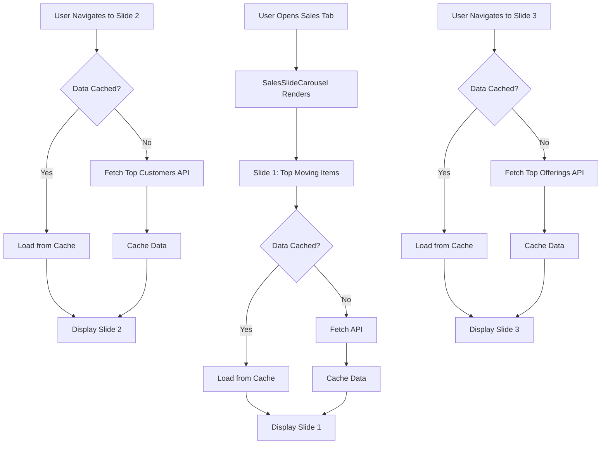

# Sales Slide Carousel with Lazy Loading

## Problem Statement

Currently, the Dashboard Sales section loads all data upfront (8 API calls in parallel) when the sales tab is active, causing:

- Slow initial load time
- Unnecessary API calls for data the user may never view
- Poor performance on slower connections

## Solution Architecture

### Component Structure

```
Dashboard.jsx
  └── SalesSlideCarousel (new component)
       ├── Slide 1: Top Moving Items (loads immediately)
       ├── Slide 2: Top 10 Customers (lazy loads on visit)
       └── Slide 3: Top 10 Offerings (lazy loads on visit)
```

### Data Flow



## Implementation Plan

### 1. Create SalesSlideCarousel Component

**File**: `frontend/src/components/SalesSlideCarousel.jsx`

- Manages current slide index state (0, 1, 2)
- Tracks which slides have been visited/loaded
- Per-slide data cache (separate from Dashboard cache)
- Handles navigation (arrows, dots, swipe)
- Lazy loading logic per slide

**Features**:

- Slide navigation: Previous/Next arrows, dot indicators
- Mobile swipe gestures (touch events)
- Desktop keyboard navigation (optional)
- Loading states per slide
- Smooth transitions using framer-motion (already in dependencies)

### 2. Create Individual Fetch Functions

**File**: `frontend/src/components/Dashboard.jsx`

Split `fetchSalesData` into separate functions:

- `fetchTopMovingItems(params)` - called when slide 1 is visited
- `fetchTopCustomers(params)` - called when slide 2 is visited  
- `fetchTopOfferings(params)` - called when slide 3 is visited

Each function:

- Checks per-slide cache first
- Only fetches if cache is invalid or missing
- Updates per-slide cache on success
- Returns data or throws error

### 3. Modify Dashboard.jsx Sales Section

**File**: `frontend/src/components/Dashboard.jsx`

**Changes**:

- Remove `topMovingItems`, `topCustomers`, `topOfferings` from `fetchSalesData` Promise.all
- Remove these three sections from the render (lines ~1167-1352)
- Replace with `<SalesSlideCarousel />` component
- Pass individual fetch functions as props
- Pass date filter params for API calls
- Maintain existing cache structure for other sales data (revenue breakdown, payment distribution, etc.)

### 4. Per-Slide Caching Strategy

**Implementation**:

```javascript
const [slideCache, setSlideCache] = useState({
  topMovingItems: { data: null, timestamp: null, params: null },
  topCustomers: { data: null, timestamp: null, params: null },
  topOfferings: { data: null, timestamp: null, params: null }
})
```

Cache key includes:

- Date filter params (filter, selectedYear, selectedMonth)
- Branch ID
- Timestamp (5 minute TTL)

### 5. Swipe Gesture Implementation

**Mobile Support**:

- Use native touch events (touchstart, touchmove, touchend)
- Minimum swipe distance: 50px
- Horizontal swipe only
- Prevent vertical scroll interference

**Desktop Support**:

- Left/Right arrow buttons
- Dot indicators (clickable)
- Optional: Keyboard arrow keys

### 6. CSS Styling

**File**: `frontend/src/components/SalesSlideCarousel.css`

- Slide container with overflow hidden
- Smooth transitions
- Responsive design (mobile/desktop)
- Navigation controls styling
- Loading skeleton states

## Files to Modify

1. **frontend/src/components/Dashboard.jsx**

   - Remove topMovingItems, topCustomers, topOfferings from `fetchSalesData`
   - Add individual fetch functions
   - Replace three sections with `<SalesSlideCarousel />`
   - Update cache structure

2. **frontend/src/components/SalesSlideCarousel.jsx** (NEW)

   - Main carousel component
   - Slide management
   - Lazy loading logic
   - Navigation controls
   - Swipe gesture handlers

3. **frontend/src/components/SalesSlideCarousel.css** (NEW)

   - Carousel styling
   - Slide transitions
   - Navigation controls
   - Responsive breakpoints

## API Endpoints (No Changes)

- `/api/dashboard/top-moving-items?{params}`
- `/api/dashboard/top-customers?{params}&limit=10`
- `/api/dashboard/top-offerings?{params}&limit=10`

## Performance Benefits

1. **Initial Load**: Only 1 API call (Top Moving Items) instead of 8
2. **On-Demand Loading**: Other slides load only when user navigates
3. **Caching**: Revisiting slides uses cache (no refetch)
4. **Reduced Bandwidth**: ~87% reduction in initial API calls

## Edge Cases to Handle

1. User switches date filter while on slide 2/3 → invalidate cache and refetch
2. User navigates away and back → cache persists (5 min TTL)
3. API error on lazy load → show error state, allow retry
4. Empty data states → show appropriate empty messages
5. Loading state during fetch → show skeleton/loading indicator

## Testing Checklist

- [ ] Slide 1 loads immediately on Sales tab open
- [ ] Slide 2 loads only when navigated to
- [ ] Slide 3 loads only when navigated to
- [ ] Revisiting slides uses cache (no API call)
- [ ] Changing date filter invalidates cache and refetches
- [ ] Swipe gestures work on mobile
- [ ] Arrow navigation works on desktop
- [ ] Dot indicators show current slide
- [ ] Loading states display correctly
- [ ] Error states handle gracefully